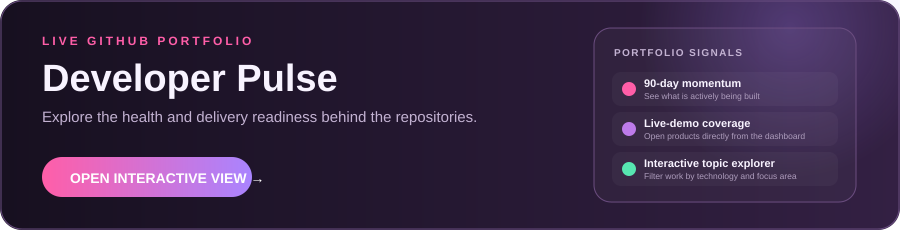

<h2 align="center">Hi 👋! My name is Husnain. I'm a Software Engineer from Pakistan.</h2>

    

<h4 align="center">Languages and Technologies I have worked with:</h4> 

    
    
    
    
    
    
    
    
    
    
    
    
    
    
    
    
    
    
    

